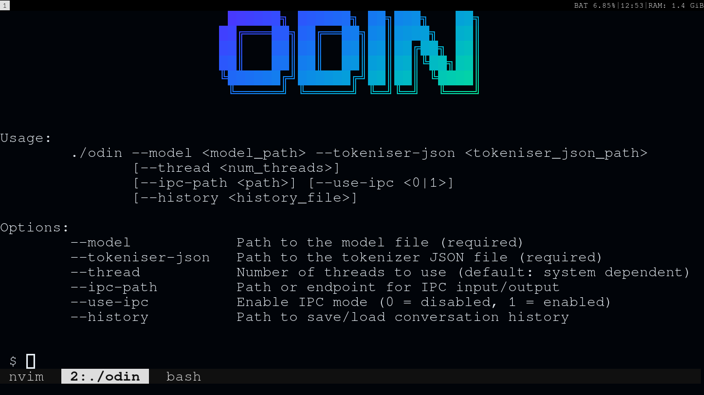
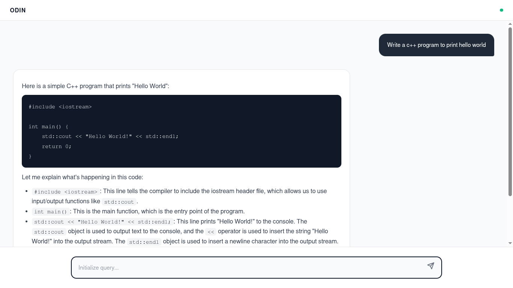

# Odin






Odin is a CPU-optimized inference engine designed for hosting on edge hardware. The primary objective is to maximize inference throughput on resource-constrained devices using quantized models (GGUF) with minimal accuracy degradation.

**Hardware Profile:** AMD Ryzen 5 7520U (4C/8T) @ 4.38GHz , Qwen 2.5 Instruct (0.5 billion parameter)

| Metric | Result |
| --- | --- |
| **Prefill Speed** | 78.29 tokens/sec |
| **Decode Speed** | 68.33 tokens/sec |
| **Median Latency (p50)** | 14.37 ms |
| **Tail Latency (p99)** | 24.36 ms |
| **Est. Memory Bandwidth** | ~30.3 GB/s |

## Installation

### Prerequisites

* A C++20 compatible compiler (GCC or Clang)
* CMake (3.14+)
* Make

### Build Instructions

```bash

git clone --recurse-submodules [https://github.com/chirag-diwan/Odin.git](https://github.com/chirag-diwan/Odin.git)
cd Odin
mkdir build && cd build
cmake .. -DCMAKE_BUILD_TYPE=Release
make -j$(nproc)

```

## Usage

Odin requires model weights in the GGUF format.

```bash
./odin --model "/path/to/model.gguf" --thread $(nproc) --tokeniser-json "/path/to/tokeniser/json" --use-ipc false --ipc-path /tmp/odin0000.socket
```

## HTTP server
> [!WARNING]
> This is a experimental feature and thus only available on the `dev` branch.

The HTTP server is hosted at `localhost:8080`(not change able)
As of the current status the server dosen't supports refreshing the context .Though on reloading the page the history will be gone from the frontend but not from the engine side. 

```bash
./odin-http-server --model "/path/to/model.gguf" --tokeniser-json "/path/to/tokeniser/json"
```

### CLI Arguments

| Argument | Description |
| --- | --- |
| `--model` | **Required.** Absolute or relative path to the `.gguf` model file. |
| `--tokeniser-json` | **Required.** The path to tokeniser.json for the specific model you are using. |
| `--thread` | **Optional.** Maximum number of threads allocated to the backend for computation. |
|`--ipc-path` | **Optional** Path or endpoint for ipc input/output.|
|`--use-ipc` |**Optional** Enable/disable ipc mode (false = off, true = on).|


## Current State

**Alpha / Active Development**
Odin currently supports the **Qwen2** and **LLama3** architecture class. Support for additional architectures is actively being implemented.
The engine is under active development and new feature will be added in future.
